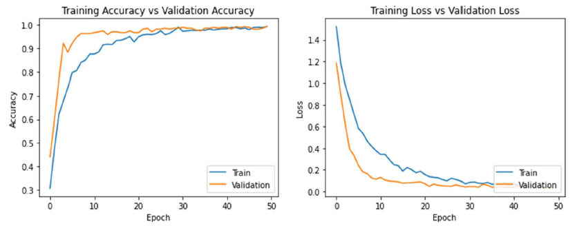
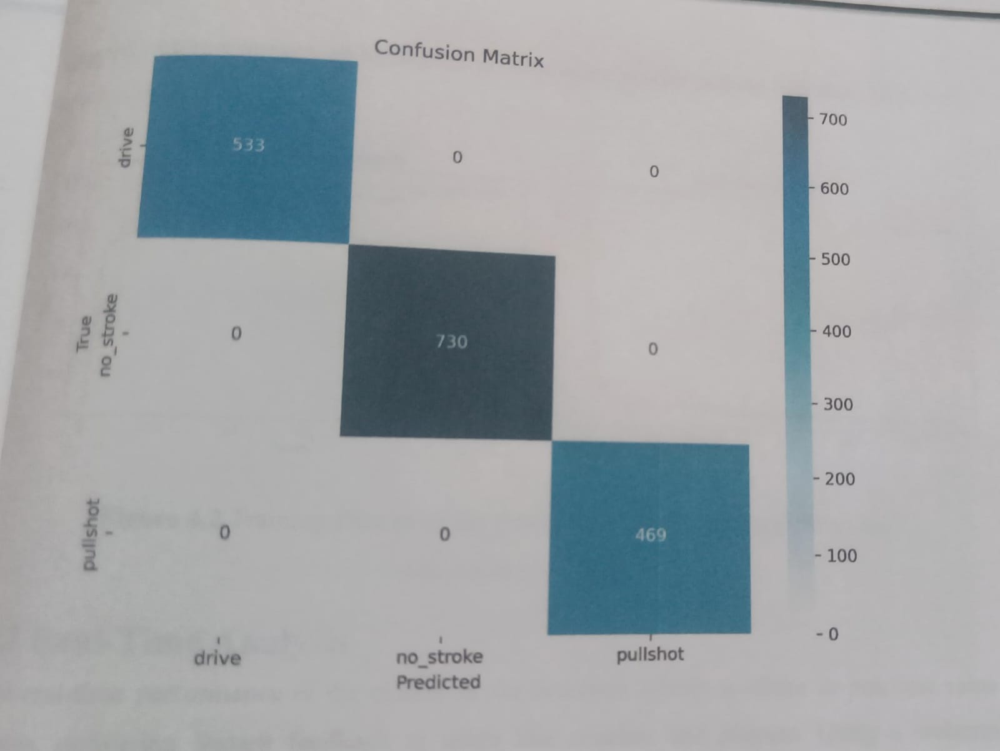

# Human Posture Detection — Cricket Stroke Analysis Using Machine Learning and Deep Learning

A deep learning approach for classifying cricket batting strokes using Convolutional Neural Networks (CNN) and MediaPipe for body keypoint detection. The core contribution of this work is a **two-track experimental design**: models are trained and evaluated both on raw images and on MediaPipe-skeletonized images, demonstrating that pose-based preprocessing consistently improves classification accuracy.

---

## Overview

Cricket stroke classification is a challenging computer vision problem due to high visual similarity between strokes, player variation, and noisy backgrounds. This project addresses these challenges by using MediaPipe Pose to extract body keypoints and render them as skeleton images on a blank canvas — stripping irrelevant visual information before feeding images into classification models.

Five deep learning models are trained and compared in two modes: with and without MediaPipe skeletonization. Results show that skeletonization provides a significant accuracy boost, particularly for the custom-designed CNN architecture.

---

## Repository Structure

```
cricket-stroke-analysis/
├── cnn-cricket.ipynb         # Main notebook: data loading, model training, evaluation
├── skeletonization.py        # MediaPipe preprocessing script
├── script.sh                 # Shell script for batch execution
├── images/
│   ├── skel.png              # Example skeletonized output
│   ├── plot.png              # Accuracy and loss curves
│   └── confusion.png         # Confusion matrix
├── loss-metrics/             # Saved training loss and accuracy logs
├── models/                   # Saved model weights
├── LICENSE
└── README.md
```

---

## Features

- **Dual-mode evaluation** — every model is benchmarked on both raw images and MediaPipe-skeletonized images to quantify the effect of pose preprocessing.
- **Custom CNN** — a purpose-built convolutional neural network (`CricketConvo2d`) designed specifically for this task.
- **Transfer learning benchmarks** — four pre-trained ImageNet models fine-tuned on the cricket stroke dataset: VGG16, InceptionV3, InceptionResNetV2, and NASNetMobile.
- **MediaPipe skeletonization** — body keypoints are extracted using `mp.solutions.pose` and plotted as white dots on a black canvas, removing all background and texture noise.
- **Full evaluation suite** — accuracy/loss curves per epoch, confusion matrix, and side-by-side model comparison.

---

## Skeletonization Pipeline

The `skeletonization.py` script preprocesses all images before training:

1. Each image is read with OpenCV and converted to RGB.
2. `mediapipe.solutions.pose.Pose` runs with `static_image_mode=True` and `min_detection_confidence=0.5`.
3. All detected body landmarks are extracted and their (x, y) pixel coordinates computed.
4. Each landmark is drawn as a white circle (`radius=5`) on a **blank black numpy array** of the same dimensions as the original image.
5. The resulting skeleton image is saved to the output folder, preserving the original filename.

This produces pose-only images that eliminate player appearance, clothing, and background — forcing models to learn purely from body geometry.

```python
# Core skeletonization logic (skeletonization.py)
mp_pose = mp.solutions.pose
pose = mp_pose.Pose(static_image_mode=True, min_detection_confidence=0.5)

keypoints_image = np.zeros((image_height, image_width, 3), dtype=np.uint8)
if result.pose_landmarks:
    for landmark in result.pose_landmarks.landmark:
        x = int(landmark.x * image_width)
        y = int(landmark.y * image_height)
        cv2.circle(keypoints_image, (x, y), 5, (255, 255, 255), -1)
```

---

## Model Architecture

### Custom CNN — `CricketConvo2d`

A convolutional neural network built from scratch and trained end-to-end on the cricket stroke dataset. This model shows the largest relative improvement from MediaPipe preprocessing (+7.73% test accuracy), indicating that lightweight architectures benefit most from clean pose-only inputs since they cannot suppress visual noise through network depth alone.

### Transfer Learning Models

| Model | Parameters | ImageNet Top-1 |
|---|---|---|
| VGG16 | ~138M | 71.3% |
| InceptionV3 | ~23M | 77.9% |
| InceptionResNetV2 | ~55M | 80.4% |
| NASNetMobile | ~5.3M | 74.4% |

All four models are fine-tuned on the cricket stroke dataset with their top layers replaced by a task-specific classification head.

---

## Results

All models evaluated on validation and held-out test sets. MediaPipe (skeletonized) vs Non-MediaPipe (raw images):

| Model | Val Accuracy | Test Accuracy | Precision | Recall | F1 Score |
|---|---|---|---|---|---|
| **CricketConvo2d (MediaPipe)** | **99.62%** | **97.09%** | 0.97 | 0.97 | 0.97 |
| CricketConvo2d (Non-MediaPipe) | 89.97% | 89.36% | 0.89 | 0.88 | 0.89 |
| VGG16 (MediaPipe) | 97.36% | 96.86% | 0.97 | 0.97 | 0.97 |
| VGG16 (Non-MediaPipe) | 95.60% | 95.53% | 0.96 | 0.95 | 0.96 |
| InceptionResNetV2 (MediaPipe) | 96.60% | 95.29% | 0.95 | 0.95 | 0.95 |
| InceptionResNetV2 (Non-MediaPipe) | 89.30% | 86.81% | 0.87 | 0.86 | 0.86 |
| NASNetMobile (MediaPipe) | 96.23% | 94.39% | 0.94 | 0.95 | 0.95 |
| NASNetMobile (Non-MediaPipe) | 94.31% | 92.77% | 0.94 | 0.92 | 0.93 |
| InceptionV3 (MediaPipe) | 95.09% | 94.39% | 0.95 | 0.94 | 0.94 |
| InceptionV3 (Non-MediaPipe) | 94.98% | 94.04% | 0.94 | 0.94 | 0.94 |

**Key finding:** MediaPipe skeletonization improves test accuracy across all models. The improvement is largest for `CricketConvo2d` (+7.73%) and `InceptionResNetV2` (+8.48%), and smallest for `InceptionV3` (+0.35%), which already generalises well from raw images via its Inception modules.

---

## Example Outputs


### Accuracy and Loss Curves


### Confusion Matrix


---

## Setup and Usage

### Prerequisites

- Python 3.8+
- TensorFlow 2.x / Keras
- MediaPipe
- OpenCV
- NumPy, Matplotlib, scikit-learn
- Jupyter Notebook

### Install Dependencies

```bash
pip install tensorflow mediapipe opencv-python numpy matplotlib scikit-learn jupyter
```

### Clone the Repository

```bash
git clone https://github.com/yourusername/cricket-stroke-analysis.git
cd cricket-stroke-analysis
```

### Step 1 — Skeletonize the Dataset

Update the `input_folder` and `output_folder` paths in `skeletonization.py`, then run:

```bash
python skeletonization.py
```

This processes all `.png`, `.jpg`, and `.jpeg` images in the input folder and saves skeleton images to the output folder, preserving filenames.

### Step 2 — Run the Notebook

```bash
jupyter notebook cnn-cricket.ipynb
```

Execute all cells to:
1. Load and preprocess both raw and skeletonized datasets
2. Define and compile all five models
3. Train with per-epoch loss and accuracy tracking
4. Generate confusion matrices and evaluation plots

### Step 3 — Batch Execution (Optional)

To run the full pipeline non-interactively:

```bash
bash script.sh
```

---

## Dataset

The dataset consists of labelled cricket batting stroke images organised by class. Each image is run through `skeletonization.py` to produce a parallel skeletonized dataset used in the MediaPipe experiments.

> You can source a suitable dataset from Kaggle by searching for cricket batting stroke datasets, or compile your own by collecting and labelling images per stroke category.

---

## Key Observations

- **Skeletonization is the single most impactful preprocessing step** — stripping background, player appearance, and clothing forces models to classify purely on body geometry, yielding consistent accuracy and F1 gains across all architectures.
- **`CricketConvo2d` benefits the most** from skeleton inputs. With raw images it achieves 89.36% test accuracy; with skeletonized inputs it reaches 97.09% — a gain that rivals the best transfer learning models.
- **`InceptionResNetV2` shows the biggest jump among transfer models** (+8.48%), suggesting its deep residual connections are well-suited to the sparse structure of keypoint images.
- **`InceptionV3` is least affected by skeletonization** (+0.35%), indicating its Inception modules already extract spatially discriminative features from raw images effectively.
- **VGG16 with MediaPipe delivers the best overall test performance** among transfer learning models at 96.86%, combining strong ImageNet features with clean pose inputs.

---

## Future Work

- Expand the dataset with more diverse images across different players, pitches, lighting conditions, and camera angles.
- Add skeletal connection lines (bones) to the skeletonization step alongside landmark dots for richer pose representations.
- Explore temporal models (LSTM, 3D CNN, Video Transformers) for video clip-based stroke classification rather than single-frame analysis.
- Build a real-time stroke detection system using MediaPipe's video-mode pipeline and a live camera feed.
- Package as a coaching tool or mobile application for on-field stroke analysis and automated feedback.

---

## References

- [MediaPipe Pose — Google](https://mediapipe.dev/)
- [VGG16 — Simonyan & Zisserman, 2014](https://arxiv.org/abs/1409.1556)
- [InceptionV3 — Szegedy et al., 2015](https://arxiv.org/abs/1512.00567)
- [InceptionResNetV2 — Szegedy et al., 2016](https://arxiv.org/abs/1602.07261)
- [NASNetMobile — Zoph et al., 2018](https://arxiv.org/abs/1707.07012)

---

## License

This project is open-source and available under the [MIT License](LICENSE).
